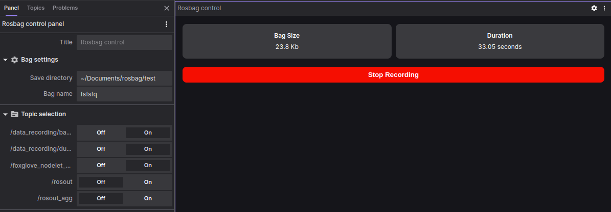

# Rosbag control panel
This extension offers controls to start and stop recording of a rosbag file within a Foxglove panel. It function with a companion [ROS node](scripts/rosbag_services.py) that proposes services and parameters to the panel. This node can be ran from another machine where the rosbag will be saved. This allows to save data directly on a robot if the remote connection is limited.



The following ROS parameters are available in the panel settings (within foxglove):
* `/data_recording/bag_name` : rosbag file name
* `/data_recording/output_directory` : file save directory (on the machine where the node is running)
* `/data_recording/topics` : list of topics to save

As the native [ROS 1](https://foxglove.dev/docs/studio/connection/data-sources#by-live-connection) connection doesn't allow to call services, the Foxglove WebSocket should be used :
```
roslaunch foxglove_bridge foxglove_bridge.launch 
```

## Install
To install the extension, download the `.foxe` file present in the latest release. Open it with Foxglove Studio and it will be installed as a local extension.


## _A Foxglove Studio Extension_

[Foxglove Studio](https://github.com/foxglove/studio) allows developers to create extensions, or custom code that is loaded and executed inside the Foxglove Studio application. This can be used to add custom panels. Extensions are authored in TypeScript using the `@foxglove/studio` SDK.

The documentation for Foxglove studio extensions can be found [here](https://foxglove.dev/docs/studio/extensions/getting-started).

### Develop

Extension development uses the `npm` package manager to install development dependencies and run build scripts.

To install extension dependencies, run `npm` from the root of the extension package.

```sh
npm install
```

To build and install the extension into your local Foxglove Studio desktop app, run:

```sh
npm run local-install
```

Open the `Foxglove Studio` desktop (or `ctrl-R` to refresh if it is already open). Your extension is installed and available within the app.

### Package

Extensions are packaged into `.foxe` files. These files contain the metadata (package.json) and the build code for the extension.

Before packaging, make sure to set `name`, `publisher`, `version`, and `description` fields in _package.json_. When ready to distribute the extension, run:

```sh
npm run package
```

This command will package the extension into a `.foxe` file in the local directory.

### Publish

You can publish the extension for the public marketplace or privately for your organization.

See documentation here: https://foxglove.dev/docs/studio/extensions/publish#packaging-your-extension
